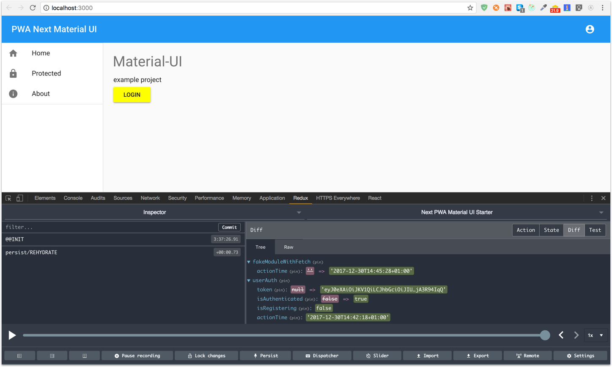

# PWA: Next JS + Redux + Redux persist + redux-devtools-extension + Material UI starter

> A progressive web app starter with NextJS, redux and bootstrap



</a>


## Detailed Content

**Front:**

* Next js (4.x+ [github :link:](https://github.com/zeit/next.js))
* React JS (16.x+ - [github :link:](https://github.com/facebook/react))
* redux (_as your application grows managing state will be a serious concern, save pain with Redux_)
* redux-persist (_simplifies your NextJS state share between pages_ [github :link:](https://github.com/rt2zz/redux-persist))
* localForage
* react-redux (_Redux is not specific to ReactJS, you could easily use it with Angular2 for instance_)
* redux-thunk (_simple and does the job_)
* next-redux-wrapper
* redux-devtools-extension ([github :link:](https://github.com/zalmoxisus/redux-devtools-extension#redux-devtools-extension))
* material UI 1.x beta ([github :link:](https://github.com/callemall/material-ui/tree/v1-beta))
* axios ([github :link:](https://github.com/mzabriskie/axios) _Why: simple, complete, isomorphic ..._)

**Tool chain:**

* Next js (4.x+ [github :link:](https://github.com/zeit/next.js))
* Flow JS types

**fav icon**

* favicons generated by [realfavicongenerator](https://realfavicongenerator.net/)

## Usage

**IMPORTANT: `Next JS` when `redux` connected**

* **you are forced to connect each page** (_even if you don't need redux in that page_) with `withRedux` from `next-redux-wrapper` (_[see page1 as an example](https://github.com/MacKentoch/react-redux-nextjs-bootstrap-starter/blob/master/pages/page1.js)_).
* **each sub component you may want to connect** should be connected by usual `connect` from `redux` (_[see Header component as an example](https://github.com/MacKentoch/react-redux-nextjs-bootstrap-starter/blob/master/components/header/Header.js)_)

### Install

```bash
npm install
```

### Scripts

#### run dev with hot reload

Clone this repository, then install dependencies:

```bash
npm run start
```

#### build dev bundle

```bash
npm run build
```

#### start dev (no hot reload)

_NOTE: ensure you built first before starting_

```bash
npm run start
```

## LICENSE

The MIT License (MIT)

Copyright (c) 2018 Erwan DATIN

Permission is hereby granted, free of charge, to any person obtaining a copy of this software and associated documentation files (the "Software"), to deal in the Software without restriction, including without limitation the rights to use, copy, modify, merge, publish, distribute, sublicense, and/or sell copies of the Software, and to permit persons to whom the Software is furnished to do so, subject to the following conditions:

The above copyright notice and this permission notice shall be included in all copies or substantial portions of the Software.

THE SOFTWARE IS PROVIDED "AS IS", WITHOUT WARRANTY OF ANY KIND, EXPRESS OR IMPLIED, INCLUDING BUT NOT LIMITED TO THE WARRANTIES OF MERCHANTABILITY, FITNESS FOR A PARTICULAR PURPOSE AND NONINFRINGEMENT. IN NO EVENT SHALL THE AUTHORS OR COPYRIGHT HOLDERS BE LIABLE FOR ANY CLAIM, DAMAGES OR OTHER LIABILITY, WHETHER IN AN ACTION OF CONTRACT, TORT OR OTHERWISE, ARISING FROM, OUT OF OR IN CONNECTION WITH THE SOFTWARE OR THE USE OR OTHER DEALINGS IN THE SOFTWARE.
